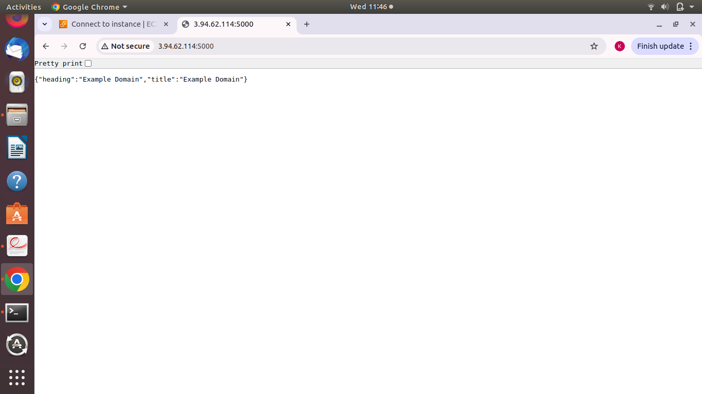

# 🕷️ Web Scraper & JSON Server using Node.js, Puppeteer, and Python Flask

This project demonstrates the use of **Node.js with Puppeteer and Chromium** for web scraping and **Python Flask** to serve the scraped data via a lightweight web server — all containerized using a **multi-stage Docker build**.

---

## 📦 Features

- Uses **Puppeteer** and **Chromium** to scrape any user-specified URL.
- Extracts the page **title** and **first `<h1>` heading**.
- Stores scraped data in `scraped_data.json`.
- Serves scraped content as JSON via **Flask web server**.
- Uses a **multi-stage Dockerfile** for a clean, small final image.

---


## 🧰 Prerequisites

- Docker installed on your system
-  sudo apt update
    sudo apt install docker.io

##### Change the Permission
    sudo usermod -aG docker $USER


---
## 📁 Project Structure
project/
│
├── scrape.js
├── package.json
├── server.py
├── requirements.txt
├── Dockerfile


## 🛠️ Build the Docker Image

You can build the image by passing a URL you want to scrape using a build argument:

```bash
docker build --build-arg SCRAPE_URL=https://example.com -t web-scrape-app .

# 🚀 Run the Container

    docker run -p 5000:5000 web-scrape-app
    


Open your browser and visit:

http://your-server-ip:5000

